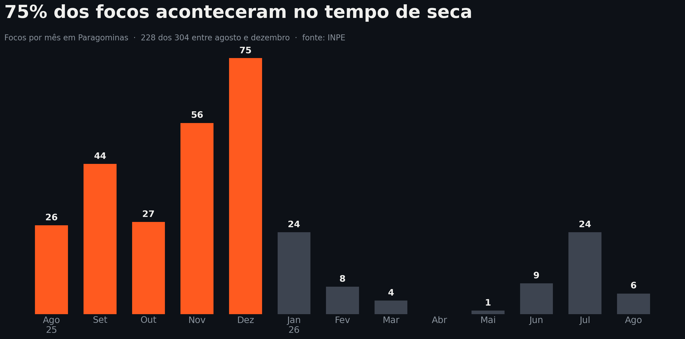

# 🔥 Aceiro

**Rede de alerta comunitário contra o fogo rural — Paragominas, Pará.**

> *O maior aceiro de Paragominas é a vizinhança.*

Projeto desenvolvido para o **Hackathon IAGRO 2026**, no desafio *"Chegada do tempo de seca: como evitar prejuízos com focos de fogo"*.

---

## O problema

Um foco de fogo, nos primeiros 20 minutos, se apaga com um abafador e duas pessoas. Depois de uma hora, precisa de caminhão-pipa e trator. O gargalo não é detectar o fogo — o satélite detecta e o dado é público. **O gargalo é que essa informação não chega, a tempo, em quem pode agir: o vizinho que está a 500 metros.**

E há um segundo obstáculo, que é o verdadeiro: na região, fogo também é ferramenta de trabalho — queima autorizada existe. Por isso, toda plataforma que promete "detectar fogo e avisar as autoridades" é lida pelo produtor como denúncia automatizada, e não é adotada.



Dados oficiais do INPE (satélite de referência AQUA_M-T, ago/2025 a ago/2026): **304 focos de calor**, sendo **75% deles entre agosto e dezembro**. Todas as detecções ocorreram entre 14h e 16h — janela única de passagem do satélite. O número real de focos é maior do que o registrado.

---

## A solução

O Aceiro **não é um detector de fogo**: é a camada de coordenação que liga quem vê o fogo a quem pode apagá-lo.

### O mecanismo central: queima declarada

O produtor registra a queima autorizada **antes** de acender (polígono, data, horário). Com isso:

- o sistema **não** dispara alarme para fogo esperado dentro do combinado;
- os vizinhos recebem **aviso preventivo** em vez de susto;
- o produtor fica com um **registro que o protege** caso o fogo escape.

De vigilância vira coordenação — e a adoção passa a acontecer por interesse próprio, não por civismo.

### Três camadas de detecção

| Camada | Como funciona | Custo p/ o usuário |
|---|---|---|
| **Humana** | Relato via bot de WhatsApp, com foto e localização, sem instalar nada | Gratuito |
| **Satélite** | Focos públicos do INPE integrados ao mapa | Gratuito |
| **Sentinela** | Câmera PTZ + visão computacional própria, 24h, com estação meteorológica no mesmo mastro | Assinatura (fazendas grandes) |

### O alerta

Quando confirma, o Aceiro **liga** — chamada de voz que fura o silencioso e funciona em 2G: *"foco a 3 km, vento na sua direção, 50 minutos até sua divisa; o caminhão-pipa mais próximo já confirmou que está indo."*

---

## Público

- **Usuário** (nunca paga): produtor rural, vaqueiro, gerente, brigadista.
- **Cliente** (paga): reflorestadoras e fazendas grandes, prefeitura, seguradoras e bancos de crédito rural, projetos de carbono.

---

## Estrutura do repositório

```
docs/                    documento de produto, prévia técnica e gráficos
dados/                   focos de calor do INPE (CSV) usados na análise
analise/                 script que gera os gráficos a partir do CSV
visao-computacional/     notebook e código de detecção de fumaça
mockups/                 telas do produto
```

---

## Reproduzir a análise

```bash
pip install matplotlib
python analise/gerar_graficos.py
```

Fonte dos dados: [Programa Queimadas / INPE](https://terrabrasilis.dpi.inpe.br/queimadas/bdqueimadas/) — acesso público e gratuito.

---

## Estado do projeto

Conceito validado e prototipado para hackathon. O que já existe, o que exige trabalho e o que depende de terceiros está documentado com honestidade no **semáforo do fundamento** (seção 15 do [documento de produto](docs/aceiro-documento-de-produto-v2.md)).

Validação externa: um doutor em sensoriamento remoto avaliou o projeto e concluiu que ele resolve não apenas o problema técnico, mas o problema de confiança e adoção — o verdadeiro obstáculo desse tipo de solução.

---

## Equipe

*(nomes da equipe)* — Engenharia de Software, UEPA Campus Paragominas.
